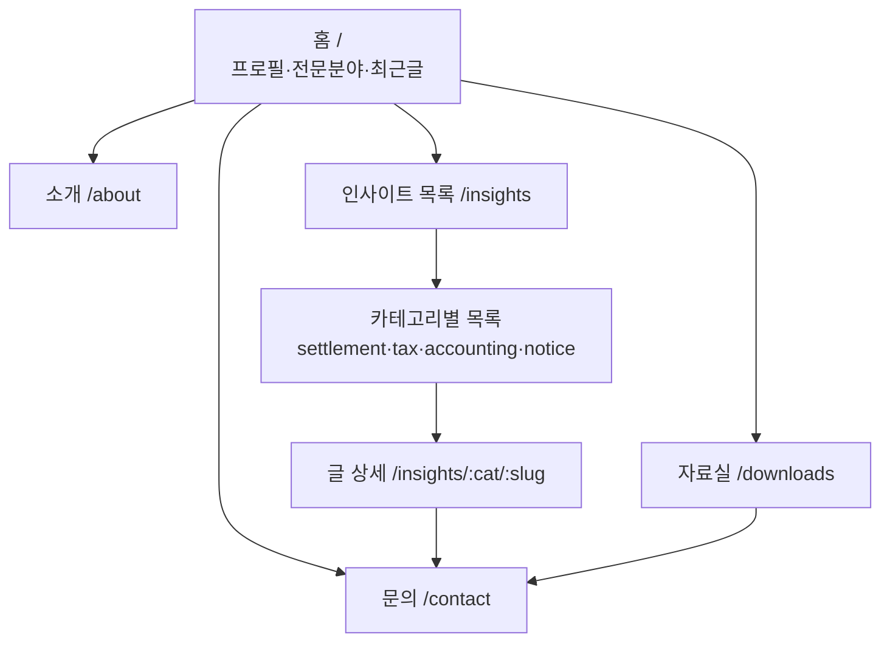

# 회계사 개인 홈페이지 — 설계 문서 (v1)

> 상태: **설계 단계** · 실제 구현 전 합의용 문서
> 작성일: 2026-07-29
> 대상 저장소: `shinesky97/ccrnd-site`

---

## 1. 목표와 방향

기존 저장소에는 **"회계법인 창천 사업비정산본부"** 회사형 원페이지(`index.html`)가
감사보고서 스타일로 완성도 높게 만들어져 있습니다.

이번 작업은 이 자산을 계승하여, **회계사 개인 브랜드 홈페이지**로 확장하는 것이 목표입니다.

| 항목 | 결정 |
|------|------|
| 정체성 | **회계사 개인 브랜드** (전문가 프로필을 전면에, 회사 소속은 병기) |
| 게시 방식 | **마크다운(.md) 작성 → GitHub Pages(Jekyll) 자동 빌드** |
| 콘텐츠 분류 | ① 사업비/정산 실무 ② 세무 정보 ③ 회계/결산 정보 ④ 공지/자료실 |
| 디자인 톤 | 기존 감사보고서 스타일(종이·먹·감청·인주 팔레트) 계승 |
| 호스팅 | GitHub Pages (커스텀 도메인 `ccrnd.com` 연결 가능) |

### 핵심 컨셉

> **"글 하나 쓰는 데 마크다운 파일 하나만 추가하면 되는, 관리 부담 없는 전문가 콘텐츠 허브"**

- 회계사 개인의 전문성·신뢰를 보여주는 프로필형 홈
- 세무/정산/회계 정보를 꾸준히 쌓는 **정보 게시판(블로그)**
- 방문자가 서식·체크리스트를 받아가는 **자료실**
- 잠재 고객이 문의를 남기는 **문의 폼** (기존 자산 재활용)

---

## 2. 기술 스택

### 왜 Jekyll + GitHub Pages 인가

| 이유 | 설명 |
|------|------|
| **무료·무서버** | GitHub Pages가 정적 호스팅 + HTTPS + CDN 제공 |
| **네이티브 지원** | GitHub Pages는 Jekyll을 서버에서 자동 빌드 (별도 CI 불필요) |
| **마크다운 우선** | 글 = `.md` 파일 1개. 목록/본문 페이지는 자동 생성 |
| **버전 관리** | 모든 글이 Git 히스토리로 남음 (수정 이력 추적) |
| **확장 용이** | 태그·카테고리·검색·RSS를 플러그인/템플릿으로 추가 가능 |

### 구성 요소

```
GitHub 저장소 (main 브랜치)
        │  push
        ▼
GitHub Pages 빌드 (Jekyll)
        │
        ▼
정적 사이트 (https://ccrnd.com)
```

- **Jekyll**: 마크다운 → HTML 정적 사이트 생성기
- **Liquid**: 템플릿 언어 (레이아웃·반복·조건)
- **GitHub Pages**: 빌드 + 호스팅
- 외부 런타임/DB 없음 → 유지비 0원, 장애 요인 최소

> 참고: 문의 폼은 정적 사이트라 서버가 없으므로, 기존과 동일하게
> **FormSubmit**(외부 폼 전송 서비스)을 그대로 사용합니다.

---

## 3. 사이트 구조 (IA)

```
홈 (/)                         프로필 + 전문분야 + 최근 글 모음
├── 소개 (/about)              회계사 이력·전문분야·자격
├── 인사이트 (/insights)        전체 글 목록 (최신순)
│   ├── 사업비·정산 실무 (/insights/settlement)
│   ├── 세무 정보 (/insights/tax)
│   ├── 회계·결산 정보 (/insights/accounting)
│   └── 공지·자료실 (/insights/notice)
├── 글 상세 (/insights/:category/:slug)
├── 자료실 (/downloads)        서식·체크리스트 다운로드
└── 문의 (/contact)            문의 폼 (기존 재활용)
```

### 네비게이션 메뉴

```
[회계사 브랜드]   소개 · 인사이트 · 자료실 · 문의하기(CTA)
```

기존 사이트의 `#services / #works / #process / #resources / #contact`
앵커 메뉴를 → 실제 페이지 기반 메뉴로 승격합니다.

### 화면 흐름도



---

## 4. 콘텐츠 모델 (글 데이터 구조)

각 글은 `_posts/` 안의 마크다운 파일 하나입니다.

### 파일명 규칙

```
_posts/YYYY-MM-DD-slug.md
예) _posts/2026-07-29-rise-indirect-cost-guide.md
```

### 글 앞머리(Front Matter)

```yaml
---
layout: post
title: "RISE 사업 간접비, 이렇게 집행하면 불인정됩니다"
date: 2026-07-29
category: settlement          # settlement | tax | accounting | notice
tags: [RISE, 간접비, 불인정사례]
summary: "간접비 집행에서 자주 지적되는 5가지 유형과 예방 포인트를 정리했습니다."
author: 손슬기                 # ← 실제 회계사 성함으로 확정 필요
---

여기부터 마크다운 본문...

## 소제목
- 목록
- **강조**

> 인용/핵심 요약
```

### 카테고리 정의

| 코드 | 이름 | 다루는 내용 |
|------|------|-------------|
| `settlement` | 사업비·정산 실무 | 국고보조금·RISE·연구비 정산, 불인정 사례, 증빙 체크리스트 |
| `tax` | 세무 정보 | 종합소득세·부가세·법인세·연말정산, 절세 팁, 법령 개정 |
| `accounting` | 회계·결산 정보 | 결산 실무, K-IFRS, 재무제표 읽는 법, 원가 |
| `notice` | 공지·자료실 | 서식 배포, 법령 개정 소식, 공지사항 |

---

## 5. 파일/폴더 구조 (구현 시)

```
ccrnd-site/
├── _config.yml               # 사이트 설정 (제목·메뉴·URL·카테고리)
├── index.html                # 홈 (프로필 + 최근 글)  ← 기존 파일 재구성
│
├── _layouts/                 # 페이지 뼈대 템플릿
│   ├── default.html          #   공통(header·footer 포함)
│   ├── home.html             #   홈 전용
│   ├── post.html             #   글 상세 (본문 타이포 최적화)
│   ├── category.html         #   카테고리별 글 목록
│   └── page.html             #   일반 페이지(소개·자료실)
│
├── _includes/                # 재사용 조각
│   ├── header.html           #   상단 네비게이션
│   ├── footer.html           #   하단 정보
│   ├── seal.html             #   직인 SVG 시그니처 (기존 자산)
│   └── post-card.html        #   글 목록 카드 1개
│
├── _posts/                   # ★ 여기에 글(.md)만 추가하면 게시됨
│   ├── 2026-07-29-example-settlement.md
│   └── ...
│
├── insights/                 # 인사이트 목록 페이지들
│   ├── index.html            #   전체 목록
│   ├── settlement.html       #   카테고리 목록 (category 레이아웃 사용)
│   ├── tax.html
│   ├── accounting.html
│   └── notice.html
│
├── about.md                  # 소개(프로필)
├── contact.html              # 문의 폼 (기존 폼 이식)
├── downloads.md              # 자료실
│
├── assets/
│   ├── css/style.css         # 기존 인라인 CSS를 분리·확장
│   └── files/                # 배포용 서식·PDF
│
└── DESIGN.md                 # (본 문서)
```

> 기존 `index.html`의 인라인 `<style>`은 `assets/css/style.css`로 분리하여
> 모든 페이지가 공유하게 합니다. 디자인 토큰(색·폰트)은 그대로 유지합니다.

---

## 6. 디자인 시스템 (기존 계승 + 확장)

기존 사이트의 "감사보고서" 미학을 그대로 유지합니다.

### 디자인 토큰 (변경 없음)

```css
--paper:#FBFBF8;   /* 배경(종이) */
--paper-deep:#F2F3EF;
--ink:#1B2434;     /* 본문(먹) */
--blue:#27497A;    /* 강조(감청) */
--inju:#BE3A2B;    /* 포인트(인주) */
--rule:#D9DBD4;    /* 구분선 */
--muted:#5C6572;

--serif:'Noto Serif KR'   /* 제목 */
--sans:'Pretendard'       /* 본문 UI */
--mono:'IBM Plex Mono'    /* 라벨·연도·번호 */
```

### 확장이 필요한 부분 (신규 컴포넌트)

| 컴포넌트 | 용도 | 디자인 방향 |
|----------|------|-------------|
| **글 카드** | 목록에서 글 1개 | 카테고리 라벨(mono) + 제목(serif) + 요약 + 날짜 |
| **본문 타이포** | 글 상세 읽기 | 본문 폭 제한(680px), 넉넉한 행간, 소제목/인용/표 스타일 |
| **카테고리 탭** | 목록 필터 | 상단 4개 탭, 활성 시 감청 밑줄 |
| **프로필 블록** | 홈/소개 | 회계사 사진·이름·자격·전문분야 요약 |
| **자료 다운로드 행** | 자료실 | 파일명 + 형식 뱃지 + 다운로드 링크 |

기존의 **직인(seal) SVG, 원장(ledger) 테이블, 문서 메타 헤더** 스타일은
개인 브랜드 톤에 맞게 재사용합니다.

---

## 7. 글 게시 워크플로우

작성자가 새 글을 올리는 과정은 다음과 같이 단순합니다.


### 두 가지 게시 방법 제공

1. **GitHub 웹 에디터** — 브라우저에서 `_posts` 폴더에 파일 추가/편집 → 커밋
   (터미널·Git 지식 없이도 글 게시 가능. 회계사 본인이 직접 운영하기 적합)
2. **로컬 Git** — 편집기로 작성 후 push (더 편한 대량 작업)

### 편의 장치 (구현 시 포함)

- `_posts/_TEMPLATE.md` — 새 글 작성용 템플릿(복사해서 사용)
- 카테고리별 색상 라벨 자동 표시
- 최신 글이 홈·목록 상단에 자동 정렬
- (선택) RSS 피드, 사이트맵, 간단한 클라이언트 검색

---

## 8. 페이지별 설계 상세

### 홈 (`/`)
- 상단: 회계사 프로필(이름·자격·한 줄 소개) + 대표 CTA(문의/상담)
- 중단: 전문 분야 3~4개 카드 (기존 서비스 카드 스타일)
- 하단: **최근 글 6개** 카드 그리드 → 인사이트로 유도
- 신뢰 요소: 주요 수행 실적 요약(기존 원장 테이블 축약)

### 소개 (`/about`)
- 회계사 이력·경력·자격(공인회계사 등록번호 등)
- 전문 분야 상세, 실무 철학("예방하고, 막아냅니다" 톤 계승)
- 연락처·소속(회계법인 창천 사업비정산본부)

### 인사이트 목록 (`/insights` + 카테고리)
- 상단 카테고리 탭 4개
- 글 카드 리스트(최신순), 페이지네이션
- 각 카드: 카테고리 라벨 · 제목 · 요약 · 날짜 · 태그

### 글 상세 (`/insights/:cat/:slug`)
- 문서 메타 헤더(카테고리·날짜·작성자)
- 읽기 최적화 본문(680px 폭)
- 하단: 관련 글, 문의 유도 CTA

### 자료실 (`/downloads`)
- 서식·체크리스트·가이드 PDF 목록
- 파일별: 이름 · 형식 뱃지 · 설명 · 다운로드
- 자료 요청 이메일 링크(기존 재활용)

### 문의 (`/contact`)
- 기존 FormSubmit 폼 그대로 이식
- 주소·이메일·전화·업무시간 정보

---

## 9. 구현 로드맵 (설계 승인 후)

| 단계 | 작업 | 산출물 |
|------|------|--------|
| **1. 골격** | Jekyll 설정(`_config.yml`), 레이아웃/인클루드, CSS 분리 | 빌드되는 빈 사이트 |
| **2. 홈·소개** | 홈/소개 페이지 + 프로필 블록 | 프로필 완성 |
| **3. 게시 시스템** | `_posts` 구조, 목록/카테고리/상세 템플릿, 템플릿 글 | 글 게시 가능 |
| **4. 자료실·문의** | 자료실, 문의 폼 이식 | 전 페이지 완성 |
| **5. 콘텐츠** | 각 카테고리 예시 글 1~2개 작성 | 실제 정보 게시 |
| **6. 도메인·마감** | 커스텀 도메인(`ccrnd.com`), SEO/OG 태그, RSS | 공개 |

---

## 10. 확정이 필요한 사항 (구현 전 확인)

구현에 앞서 아래만 확정해 주시면 바로 착수하겠습니다.

1. **회계사 성함·자격 정보** — 홈/프로필/작성자에 들어갈 이름과 공인회계사 등록번호 등
   (기존 이메일 `seulgison@atcc.co.kr` 기준, "손슬기 회계사"로 추정 — 확인 필요)
2. **회사 병기 범위** — "회계법인 창천 사업비정산본부" 소속을 어느 정도 노출할지
3. **도메인** — 기존 `ccrnd.com`을 이 사이트에 연결할지
4. **프로필 사진** — 사용 여부 및 이미지 제공 가능 여부
5. **첫 게시 글** — 오픈 시 함께 올릴 예시 글 주제(카테고리별 1개 권장)

---

*본 문서는 설계 합의용이며, 승인 후 위 로드맵에 따라 실제 사이트를 구축합니다.*
